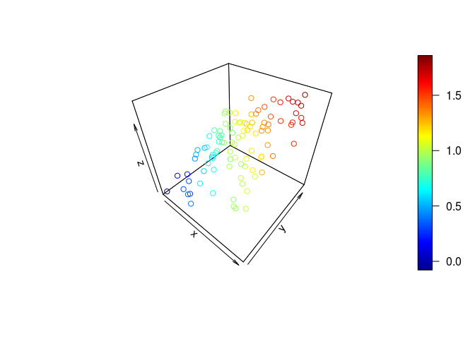

#多重共線性とは

説明変数同士が強く相関していること．
例えば月の売り上げが月の降水量と月の降水日数に比例するモデルを考えると，降水量と降水日数の間は相関しているので，このモデルには多重共線性がある．

多重共線性があると，回帰係数の標準誤差が大きくなり、訓練データが変わる(増える)度に分析結果が大きく変わりうるらしい．
でも予測精度には影響しないとか．
……なにが起きてるの？
どういう時に問題になるだとか，数学的にはどういう状況かとかいった説明はWeb上に沢山見かける([例](http://www.housecat442.com/?p=494))ので、今回は図で理解したい．

#多重共線性のないとき

$z = x + y$


```r
n <- 100
x <- runif(n) + rnorm(n, sd = 0.05)
y <- runif(n) + rnorm(n, sd = 0.05)
z <- x + y + rnorm(n, sd = 0.05)
plot3D::scatter3D(x, y, z)
```




どう頑張っても，これらの点を乗せられる平面は1面しか描けないと思う．

#多重共線性のある時

xとyが1:1で比例するようにしてみた．


```r
y <- x + rnorm(n, sd = 0.05)
z <- x + y + rnorm(n, sd = 0.05)
plot3D::scatter3D(x, y, z)
```


今度も$z = x + y$に乗るが， 直線上に並んだ点を乗せる面は無数に描けるので
$z = 2x$,
$z = 0.1x + 1.9y$
$z = 100x - 98y$
などにも乗る．

回帰係数の標準誤差が大きく，その大小や正負の関係も信用成らないとはこのことかとお分かり頂けると思う．  
ということは，たまたま追加したデータのxまたはyが外れ値だったりすると，直前とは全く異なる面で回帰されるだろうことが分かる．

一方でどの式を解としても予測には影響がない．

#多重共線性を避けるには

回帰係数の大小に興味がなく，予測しかしないならば，多重共線性は必ずしも忌避すべきものではない．
ただし，観測値が不足すると，ランク不足により，説明変数を減らす必要が生じうる．
こんな時は明示的に説明変数を取捨選択してもいいし，LASSOなどの正則化を用いるのも手だ．


