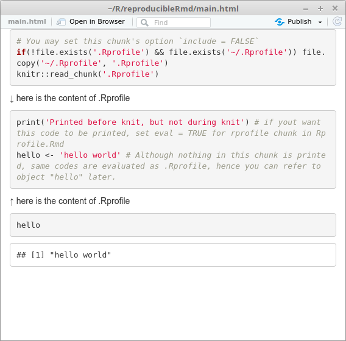

# はじめに

科学の再現性が改めて重視される世にあって、Rmarkdownの便利さもより強く認識される日々です。

例えば、@kohske さんが「再現可能性のすゝめ」というRmd本を執筆しました。
https://qiita.com/kohske/items/3e8c02e9598c6d230a47

ちなみにまだ買ってもいません…………。

このため、同書で言及されているかは知りませんが、Rmdを使って再現性を確保していくにあたって、問題となりうることの一つに

.Rprofile

があります。

これは、R起動時に実行したしスクリプトを書いておくところで、

- CRANミラーの選択
- ライブラリの読み込み
- メッセージの表示

などなど、いろいろなことができます。

.Rprofileをホームディレクトリに置いて、オレオレR環境を整備しておくと便利なのですが、Rmdのknit時にも読み込まれてしまうため、異なる環境で同じRmdファイルをknitしても同じ出力が得られるとは限りません。

しかし、.Rprofileをうまく使うと、Rmdファイルを作成する度に読み込むパッケージを羅列する必要がなくなるので便利です。

どうしたら、再現性を保ちつつ、.Rprofileを運用できるのでしょうか。

# working directoryに.Rprofileを置く

working directoryに.Rprofileを置くと、それはホームディレクトリ下のものよりも高い優先順位を持ちます。
RStudio上でプロジェクトを管理しているならば、プロジェクトディレクトリ = working directoryなので、そこに.Rprofileをコピーするといいでしょう。
ディレクトリを丸ごと別環境に移しても.Rprofileの内容が再現されます。

これで子chunkだけを実行する時も、必ず実行したいコードは.Rprofileに仕込めばOKですね!

# Rmd内に、.Rprofileをインポートする

発展的には、プロジェクトディレクトリに置いた.RprofileをRmdファイルにインポートすると、出力(htmlなど)で.Rprofileの内容も確認できて便利です。
これには少々工夫がいります。

`source('.Rprofile')` では、.Rprofile中のソースコードが出力に表示されないためです。

`child = '.Rprofile'` も.RprofileがRmdファイルではないがために愉快な出力になります。

## そこで下記のようにします

### .Rprofileの編集

冒頭に `## @knitr rprofile` を追記し、Rmdから.Rprofileを取り込めるようにしましょう([参考](https://qiita.com/yu-iskw/items/ad6e18b65ae33d90d00a
))。

```r:.Rprofile
print('Printed before knit, but not during knit') # if yout want this code to be printed, set eval = TRUE for rprofile chunk in Rprofile.Rmd
hello <- 'hello world' # Although nothing in thi chunk is printed, same codes are evaluated as .Rprofile, hence you can refer to object "hello" later.
```

繰り返しになりますが、プロジェクトディレクトリに置いておきます。

### .Rprofileを取り込むRmdファイルを作成

下記のように Rprofile.Rmd を作成しましょう。

~~~r:Rprofile.Rmd
```{r, include = FALSE}
knitr::read_chunk("script.R")
```　
↓ here is the content of .Rprofile
```{r rprofile eval = TRUE}
```　
↑ here is the content of .Rprofile
~~~

ここで何をしているかは @yu-iskw さんの

[Knitr で外部の R スクリプトの取り込む方法](https://qiita.com/yu-iskw/items/ad6e18b65ae33d90d00a)

を参考にしてください。

### メインのRmdからrprofile.Rmdを呼び出す

~~~r:main.Rmd
```{r child = 'Rprofile.Rmd'}
```　
~~~

### knitする

出力はこんな感じ




ちなみに、Rmdを子chunkに分割した時、子chunkで `child = 'rprofile.Rmd'` を行う必要はありません。
そうせずとも、テスト用の子chunkをknitした時も、.Rprofileの読み込みは行われます。
.Rprofileの中身を見せる必要があるのは、親chunkに出力だけだと思います。


# Enjoy ([ソースコードはGitHub](https://github.com/atusy/reproducibleRmd))

