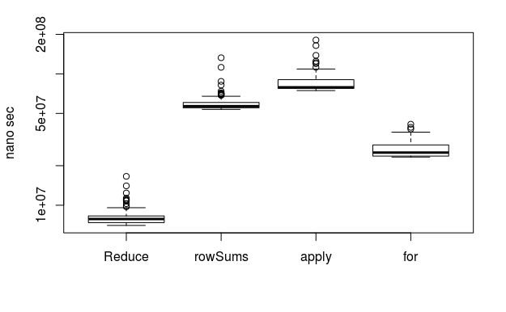

先日の

[data.frameの高速演算には列ごとならlapply、行ごとならReduceを使おう](https://qiita.com/Atsushi776/items/176426e2195b18eb65b4)

がTwitter上で予想以上のLike, Retweetを頂いております。
軽い気持ちで書いた記事だったのでもう少し踏み込みます。

# 先日の記事について

matrixを行ごとの和を求める場合、100行100列なら

rowSums < apply < for

であることを示しました。
また、data.frameの場合は、

Reduce < rowSums < apply < for

であることを示しました。

そして、rowSumsやapplyはmatrixに特化しており、data.frameをmatrixに変換するオーバーヘッドが発生するのに対し、Reduceはdata.frameをそのまま扱うことが可能なことが一因と説明し、データごとに最適な計算を考えましょうと訴えました。

しかし、以下の疑問が浮いてきました。

- Reduceに入力された変数は、要素を順々に処理するので、行が増えた場合、rowSumsやapplyより遅くなるのでは？
- forならdata.frameに最適なコードを記述すれば、matrix用の関数(rowSumsやapply)より速くなってもいいのでは？
    - しかもイマドキ(R > 3.4.0)ではJITがforも加速する

# 実験

先日のコードの修正したものをもとに、100行100列のdata.frameを始めとして、100行10万列までテストデータを巨大化しつつ、ベンチマークします。

```r
library(microbenchmark) # ベンチマークようのパッケージ
set.seed(123) # 乱数を固定
nr <- 100 # テストデータの行数
nc <- 1e+2 # テストデータの列数

x <- as.data.frame(matrix(runif(nr*nc), nr, nc))
# テストデータの生成

plot(microbenchmark(
  Reduce = Reduce(`+`, x),
  rowSums = rowSums(x),
  apply = apply(x, 1, sum),
  "for" = {
      y <- numeric(ncol(x2))
      for(i in 1:nrow(x2)) y <- y + x[[i]]
      y
  }
), xlab = '', ylab = 'nano sec', log = 'y')
```

## 100行100列


Reduce速い！
forおっそ！

## 100行1,000列


Reduce速い！
やはりforおっそ！

## 100行10,000列



Reduce速いけど、あ、あれ？！ for頑張ってる？

## 100行100,000列


おおお？！ forはええ！！

# 結論

先日結論した通りデータに最適なコードはやはり大事。
data.frameの行の和を求める場合

Reduce < rowSums < apply

の関係は少なくとも100行100列から100行10万列までは変わらない。

forは列数(すなわち繰り返し回数)が少ない時は遅いが、多い時は最速にすらなりうる(最適化は大前提として)。
多分、forの場合、繰り返し回数が少ないとJITコンパイルの所要時間が相対的に長いのだと思う。

# おまけ

100行100,000列のmatrixもforが速い！！


# Enjoy!!

