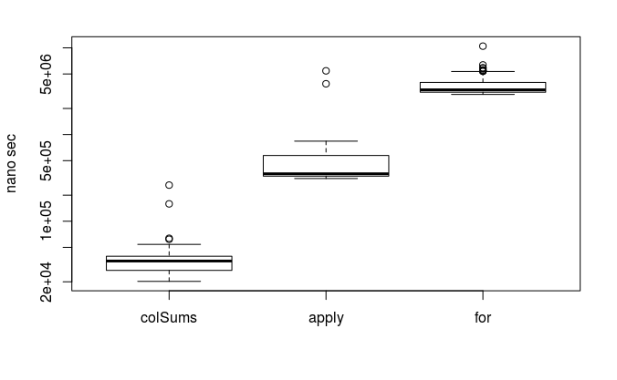
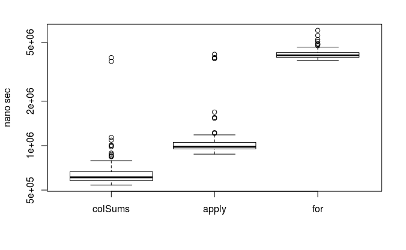
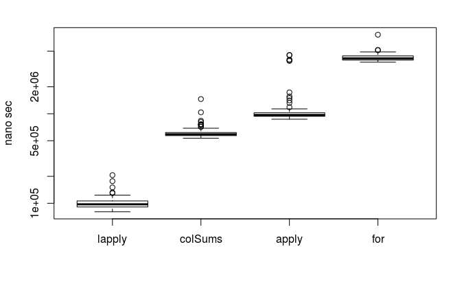
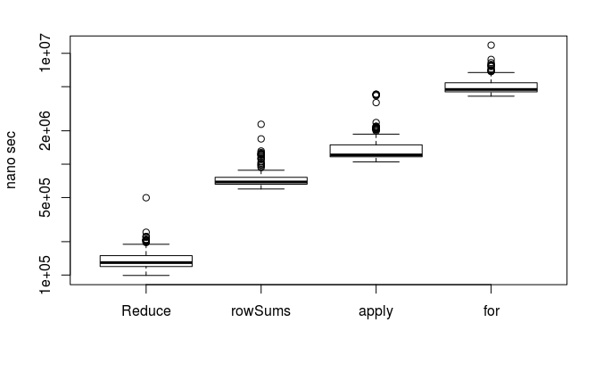

Rに少し慣れると、計算速度を早くしたいと感じるのはよくあることです。
Rを使っていてよく扱うのは行列状のデータです(matrixやdata.frame)

#matrixの場合

よく言われるのは
行列用の関数 $\geq$ apply $\geq$ for
です([参考](http://www.anlyznews.com/2012/02/r_11.html))。

##matrixを列ごとに演算

```
library(microbenchmark) # ベンチマークようのパッケージ
set.seed(123) # 乱数を固定
x <- matrix(runif(10000), 100, 100) # テストデータの生成
plot(microbenchmark( #ベンチマークとその結果のプロット
  colSums = colSums(x),
  apply = apply(x, 2, sum),
  "for" = {
      y <- numeric(nrow(x))
      for(i in 1:ncol(x)) y <- y + x[, i]
      y
  }
), xlab = '', ylab = 'nano sec', log = 'y') #y軸は対数に
```



ケタで違いますね。

#data.frameの場合

##data.frameを列ごとに演算

基本的に傾向は同じです。

```{r}
x2 <- as.data.frame(x) #先のテストデータをdata.frameに変換
plot(microbenchmark( #先のコードのxをx2に書き換えただけ
  colSums = colSums(x2),
  apply = apply(x2, 2, sum),
  "for" = {
      y <- numeric(nrow(x2))
      for(i in 1:ncol(x)) y <- y + x2[, i]
      y
  }
), xlab = '', ylab = 'nano sec', log = 'y')
```



しかし、forを用いた場合を除きケタで遅くなっているのが気になります。
これはcolSumsやapplyがmatrix(厳密にはapplyはarray)に特化しているため、内部でdata.frameを一度matrixに変換しており、変換に時間がかかっているようです。
では変換を介さない、計算を行えば速くなるのではないでしょうか。

data.frameの実態はリストです。
リストに使うapply族と言えば、lapplyです。

```{r}
x2 <- as.data.frame(x) #先のテストデータをdata.frameに変換
plot(microbenchmark( # lapplyを追加
  lapply = unlist(lapply(x2, sum)), #unlistにより他と結果を揃える
  colSums = colSums(x2),
  apply = apply(x2, 2, sum),
  "for" = {
      y <- numeric(nrow(x2))
      for(i in 1:ncol(x2)) y <- y + x2[, i]
      y
  }
), xlab = '', ylab = 'nano sec', log = 'y')
```




lapplyが群を抜いて速い！！

## data.frameを行ごとに計算

行ごとに計算する場合はどうしたらいいでしょうか？
applyの場合は第二引数で、行方向の演算か列方向の演算か指定できますが、lapplyではそうは行きません。
代わってReduceを用います。

```r
plot(microbenchmark(
  Reduce = Reduce(`+`, x2),
  rowSums = rowSums(x2),
  apply = apply(x2, 1, sum),
  "for" = {
      y <- numeric(ncol(x2))
      for(i in 1:nrow(x2)) y <- y + x2[, i]
      y
  }
), xlab = '', ylab = 'nano sec', log = 'y')
```



# まとめ

演算には扱っているデータごとに最適な形があることを意識して、
data.frameの高速演算には列ごとならlapply、行ごとならReduceを使いましょう。

# sessionInfo(一部)

R version 3.4.4 (2018-03-15)
Platform: x86_64-pc-linux-gnu (64-bit)
Running under: Linux Mint 18.3

Matrix products: default
BLAS: /usr/lib/openblas-base/libblas.so.3
LAPACK: /usr/lib/libopenblasp-r0.2.18.so

