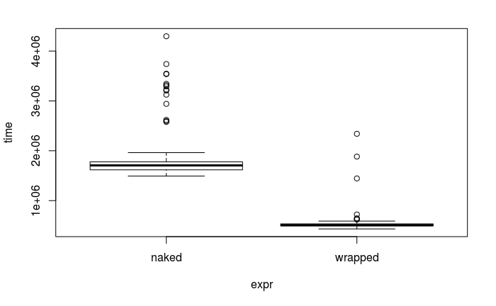
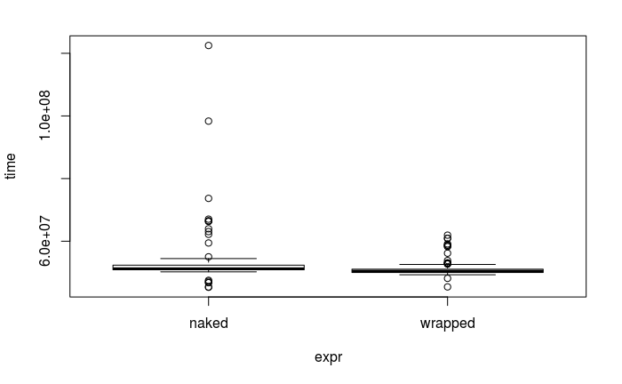
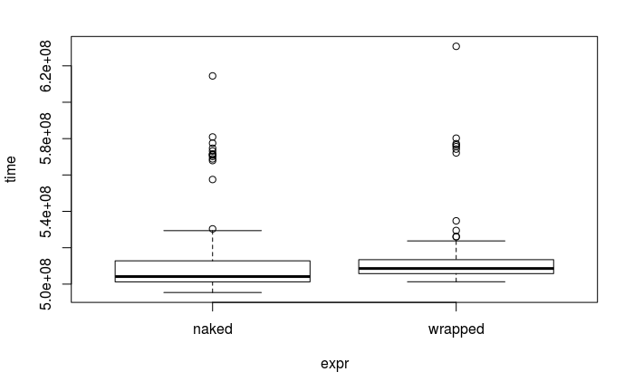
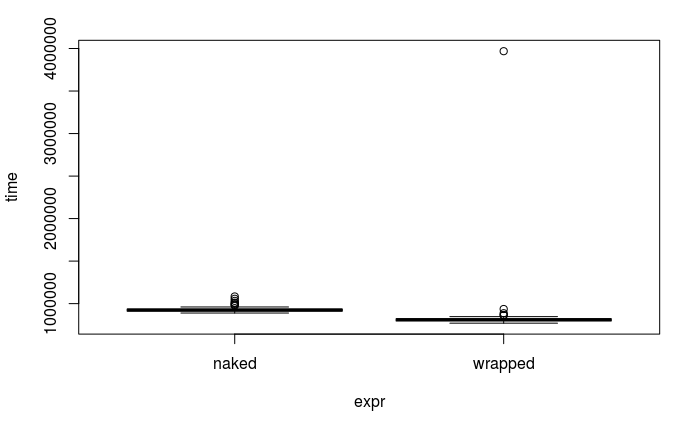

昨日偉そうなことを呟いてしまったので、実際どれくらいRのforを最適化できるだろうかと今朝、電車の中で遊んでいた。

<blockquote class="twitter-tweet" data-lang="en"><p lang="ja" dir="ltr">Rのforが遅いのは錯覚というかコツを知らないだけだ。ただ、確かにapplyファミリーやその拡張たるpurrrパッケージ、行や列ごとに演算する関数(rowSumsなど)やその拡張のmatrixStatsパッケージを使うと利便性・可読性・速度いずれ増すことが多い。pforeachは最終手段。</p>&mdash; Atsushi (@Atsushi776) <a href="https://twitter.com/Atsushi776/status/958377118420709377?ref_src=twsrc%5Etfw">January 30, 2018</a></blockquote>
<script async src="https://platform.twitter.com/widgets.js" charset="utf-8"></script>

とりあえずcolSumsと比較するぞー!
と思い、テストコードを書いてmicrobenchmarkする。

for高速化の基本として、メモリの動的確保を避け、結果を格納するオブジェクト(y)を事前に用意する。
更に関数呼び出しや代入は少なければ少ないほどいいので、結果を格納するオブジェクト(y)をインデックスとしても利用することにした。
しかしここで不思議な事態が発生。
なんとforをfunctionに入れると速くなるのだ。

**2017/2/1追記**: どうやらループ回数が少ない時は、特にJITコンパイルのオーバーヘッドが、計算時間の差に現れるようです(後述)。

```r
set.seed(123)
x <- matrix(runif(10000), 10, 1000)

microbenchmark::microbenchmark(
  `naked` = {
    y <- 1:ncol(x)
    for(i in y) y[i] <- sum(x[, i])
    y
  },
  `wrapped` = {
    (function(x) {
      y <- 1:ncol(x)
      for(i in y) y[i] <- sum(x[, i])
      y
    })(x)
  }
)

```
|expr    |      min|        lq|      mean|   median|        uq|      max| neval|
|:-------|--------:|---------:|---------:|--------:|---------:|--------:|-----:|
|naked   | 1492.253| 1617.5290| 1901.4042| 1706.717| 1777.8755| 4297.369|   100|
|wrapped |  431.556|  490.3475|  555.0379|  510.185|  533.5315| 2340.449|   100|



左が剥き出しで右が関数にラップしたもの。
速度が全然違う。
なじぇ……？

しかも行列を1000列から100000列に増やすと差が縮むっぽい(ループ回数100倍)。

|expr    |      min|       lq|     mean|   median|       uq|      max| neval|
|:-------|--------:|--------:|--------:|--------:|--------:|--------:|-----:|
|naked   | 45.29335| 50.87810| 53.68207| 51.23251| 52.36761| 122.4935|   100|
|wrapped | 45.42338| 50.00987| 51.31302| 50.44030| 51.08073|  61.9420|   100|



ループを更に10倍する



剥き出しのほうが速いことが多いけれど、ラップするほうが速度が安定している……？

勿論両者の結果は同じ

```r
y <- 1:ncol(x)
for(i in y) y[i] <- sum(x[, i])
y2 <- (function(x) {
      y <- 1:ncol(x)
      for(i in y) y[i] <- sum(x[, i])
      y
    })(x)
identical(y, y2)
# [1] TRUE
```


# 2017/2/1追記

R3.4.0以降では、JITコンパイルが導入されました(`compiler::enableJIT(3)`)。
ループ回数が少ない時は、JITコンパイルのオーバーヘッドが、計算時間の差に現れるようです。
Twitter上で考察にご協力頂いた、yutannihilationさん、TobakuCptlsmさんに感謝です。
JITを無効化するには`compiler::enableJIT(0)`を実行します。
元に戻すには`compiler::enableJIT(3)`。

```r
compiler::enableJIT(0)
set.seed(123)
x <- matrix(runif(10000), 10, 1000)

microbenchmark::microbenchmark(
  `naked` = {
    y <- 1:ncol(x)
    for(i in y) y[i] <- sum(x[, i])
    y
  },
  `wrapped` = {
    (function(x) {
      y <- 1:ncol(x)
      for(i in y) y[i] <- sum(x[, i])
      y
    })(x)
  }
)

```

|expr    |     min|       lq|     mean|   median|      uq|      max| neval|
|:-------|-------:|--------:|--------:|--------:|-------:|--------:|-----:|
|naked   | 889.575| 911.6020| 930.1113| 924.7345| 936.240| 1084.229|   100|
|wrapped | 770.046| 796.0295| 843.1757| 811.8900| 822.234| 3968.241|   100|



それでも若干wrappedの方が速いのが気持ち悪いですが……。


