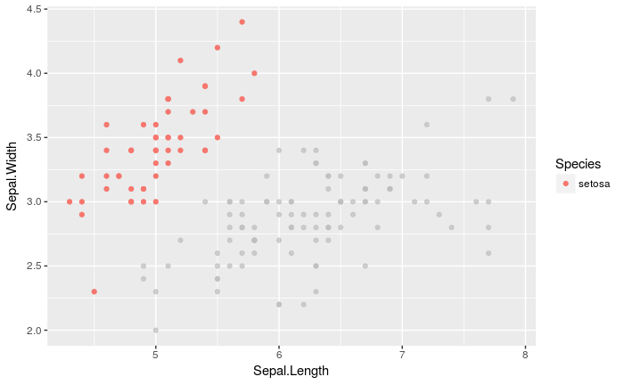
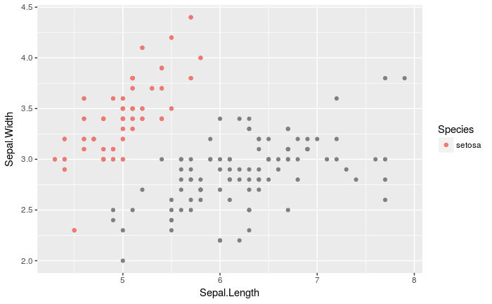
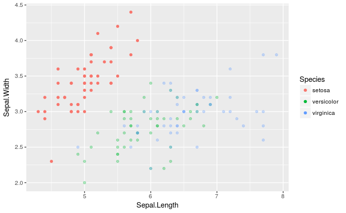
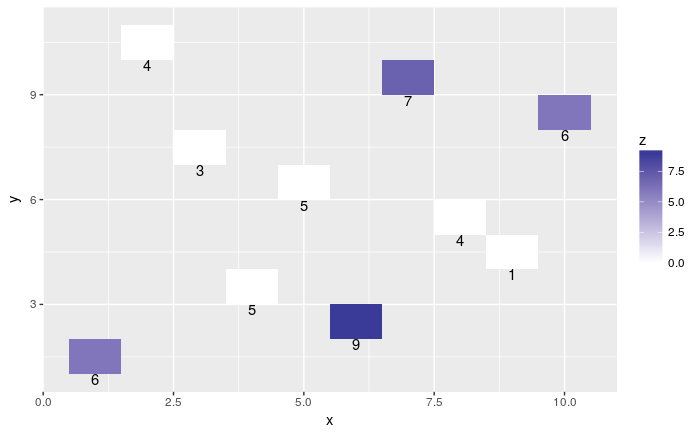

## gghighlightについて

グラフ作りにおいて、必要な情報だけを色付けてくれるパッケージ(yutannihilation氏作)
http://notchained.hatenablog.com/entry/2017/09/29/212444

```r
gghighlight_point(iris, aes(x = Sepal.Length, y = Sepal.Width, color = Species), Species == 'setosa', use_direct_label = FALSE)
```



ただし、

    - 限られたgeomにしか使えない
    - highlightはaesthenticsになっていない

といった課題がある。
前者についてはggplot_add()の登場によって解決できる見通しっぽい。
https://yutani.rbind.io/post/2017-11-07-ggplot-add/

でも実は既にあるggplot2の実装でできるんじゃね？
と思ったので試してみました。

ただ、結局、実用的なのは一部のgeomのみです(boxplotやdensityなどstatで計算を行うものは不可).
geom_point, geom_lineに加え、geom_rect, ribbon, areaなどはいけることを確認しました。

# highlightする関数を返す高階関数

.geomにはggplot2::GeomPointなどのGeom*オブジェクトを指定します。

```r
library(ggplot2)
library(purrr)
library(stringr)

gghl <- function(.geom, LL = list(colour = NA)) {
  #.geom Geom objects (e.g., ggplot2::GeomPoint)
  # LL default aethentics for lowlights
  Stats <- substitute(.geom) %>% # Generate Stat for lowlight and highlight
      deparse %>%
      stringr::str_replace('(.*::)?Geom', 'Stat') %>% 
      paste0(c('LL', 'HL')) %>% # _class LL = lowlight HL = highlight
      list(c( # compute_group
        LL = function(data, scales) {
          data[names(LL)] <- LL
          as.data.frame(data)[!as.logical(data$highlight), ]
        },
        HL = function(data, scales)
          data[as.logical(data$highlight), ]
      )) %>%
      setNames(c('_class', 'compute_group')) %>%
      purrr::pmap(
        ggplot2::ggproto,
        `_inherit` = ggplot2::Stat,
        required_aes = c(.geom$required_aes, 'highlight')
      )
  
  #return stat_ function for highlighjting
  function(
    mapping = NULL, data = NULL, geom = .geom, position = "identity", na.rm = FALSE, show.legend = NA, inherit.aes = TRUE, ...,
    .Stats = Stats
  ) {
    purrr::map(
      .Stats,
      ggplot2::layer,
      data = data, mapping = mapping, geom = geom,
      position = position, show.legend = show.legend, inherit.aes = inherit.aes,
      params = list(na.rm = na.rm, ...)
    )
  }
}
```

# 使用例

デフォルトではhighlightしないデータの色をNAにします。
それらはggplot2::scale_colour_dicreteなどscale_color*系のna.valuesに指定された色でプロットされます(既定値はgray50)

```r
g <- ggplot(iris, aes(x = Sepal.Length, y = Sepal.Width, color = Species, highlight = Species == 'setosa'))
g + gghl(ggplot2::GeomPoint)()
```


他に

    - 引数LL(lowlightの略)にalphaやfillを指定して、highlightしないデータの見た目を変える
    - 任意のstat_highlight_*を作成する

といったことが可能です

```r

stat_highlight_boxplot <- gghl(ggplot2::GeomBoxplot, LL = list(alpha = 0.3))
g + stat_highlight_point()

```


```r
geom_highlight_rect <- gghl(GeomRect, LL = list(fill = 0))
df <- data.frame(x = sample.int(10), y = sample.int(10), w = 1, z = sample.int(10, 10, replace = TRUE))
ggplot(
  df, 
  aes(xmin = x - w / 2, xmax = x + w / 2, ymin = y, ymax = y + 1, fill = z, highlight = z > 5)
) +
  geom_highlight_rect() +
  geom_text(aes(x = x, y = y, label = z), vjust = 1) +
  scale_fill_gradient2()
```



ただし、現状では、geom_boxplotやgeom_densityなど、データに対して演算を行うgeomには対応していません。

```r
ggplot(iris, aes(x = Species, y = Sepal.Length, color = Species, highlight = Species == 'setosa')) +
  gghl(GeomBoxplot)()
# Error: stat_boxplot_ll requires the following missing aesthetics: lower, upper, middle, ymin, ymax
```

