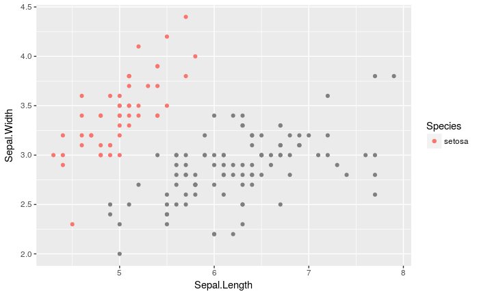

昨日の記事の続編ですが、昨日の記事のことは忘れていいです。

# gghighlightについて

グラフ作りにおいて、必要な情報だけを色付けてくれるパッケージ(yutannihilation氏作)
http://notchained.hatenablog.com/entry/2017/09/29/212444

```r
library(ggplot2)
library(gghighlight)

gghighlight_point(iris, aes(x = Sepal.Length, y = Sepal.Width, color = Species), Species == 'setosa', use_direct_label = FALSE)
```


ただし、

    - 限られたgeomにしか使えない
    - highlightはaesthenticsになっていない

といった課題がある。
前者についてはggplot_add()の登場によって解決できる見通しっぽい。
https://yutani.rbind.io/post/2017-11-07-ggplot-add/

でも実は既にあるggplot2の実装で両方解決できるんじゃね？
と思ったので試してみました。

だいたいのgeomに対応できました。
多分geom_smooth以外。
geom_quantileはいけた。

以下はggprotoの知識が必要です。
yutannihilation氏のExtending ggplot2（和訳）を理解して下さい。
https://qiita.com/yutannihilation/items/f30baef75a0ac02bb2f0

# 練習

## 散布図のhighlight(hl)したい点だけを描写するgeom_point_hlを作ってみる。

ggplotでは、与えられたデータに対して、様々な演算を行っています。
例えばgeom_boxplotではデータに対して、分位点や外れ値を計算し、使いやすいデータに整形した上で、プロットしています。
計算の仕方はgeom_*(stat = 'hogehoge')というstat引数で指定されています(geom_pointなら'identity', geom_boxplotなら'boxplot)。
この使いやすいデータに整形というところがミソで、オリジナルの計算方法を定義し、statに指定すれば、いらないデータを削ることが可能です。

では散布図の審美的属性(aethentics; aes)にhighlightを追加して、highlightにTRUEが指定されている値のみをプロットするようにしてみましょう。

```r
# 計算方法を定義
# ggprotoによるStatの作成
StatPointHL <- ggproto(
  'StatPointHL', #新しいstatのクラス名
  Stat, #継承したいggprotoオブジェクト
  compute_group = #グループごとに必要な情報以外を消す
    function(data, ...) data[data$highlight, ],
  required_aes = c('x', 'y', 'highlight') #審美的属性には散布図に必要なxとy以外に、強調したいデータかをTRUE/FALSEで示すhighlightを追加
)

# geom_point_hlを作成
geom_point_hl <- geom_point # geom_pointをコピーして
formals(geom_point_hl)$stat <- StatPointHL #stat引数を上書き

# プロットしてみる
ggplot(iris, aes(x = Sepal.Length, y = Sepal.Width, color = Species, highlight = Species == 'setosa')) +
  geom_point_hl()

```


irisのsetosa種についてのみのプロットが得られました。

## boxplotについてhighlightしたいものだけ描写する

さて、実際にはboxplotなどでは複雑な計算が行われているのは既知の通り。
ということは、StatBoxplotHLを作ろうとすると、compute_groupで、データのフィルタリングと演算両方を定義しなければなりません。
これはコードが長くなりかねない…………!
というか、既に演算方法については決めてあるので、これをコピペするのも愚かです。
例えばStatBoxplotのcompute_groupはStatBoxplot$compute_groupで取り出すことができます。

```r
StatBoxplot$compute_group
```

それなら、適宜削ったデータを、親のcompute_groupに渡せばOKですね。

```r
function(data, ...) StatBoxplot$compute_group(data = data[data$highlight, ], ...)
```

実際にはcompute_layerやcompute_panelも使われることがあるはずなので、これらもついでにwrapしましょう。
先の例ではgeom_point_hlを作りましたが、実際には、stat引数を調整するだけでいいので、その場限りの利用であれば、geom_boxplot_hlを作る必要はありません。

```r
#計算方法の定義
StatBoxplotHL <- ggproto(
  'StatBoxplotHL', #新しいstatのクラス名
  StatBoxplot, #継承したいggprotoオブジェクト
  compute_group = #グループごとに必要な情報以外を消す
    function(data, ...) StatBoxplot$compute_group(data = data[data$highlight, ], ...),
  compute_layer = #レイヤに必要な情報以外を消す
    function(data, ...) StatBoxplot$compute_layer(data = data[data$highlight, ], ...),
  compute_panel = #パネルに必要な情報以外を消す
    function(data, ...) StatBoxplot$compute_panel(data = data[data$highlight, ], ...),
  required_aes = c('x', 'y', 'highlight') #審美的属性には散布図に必要なxとy以外に、強調したいデータかをTRUE/FALSEで示すhighlightを追加
)

#使用例
ggplot(iris, aes(x = Species, y = Sepal.Width, highlight = Species == 'setosa')) +
  geom_boxplot(stat = StatBoxplotHL)

```


#実装

## 任意のgeom_についてhighlightしたいものだけ描写する

どんどん汎用的にしていきましょう。

あるgeom_についてハイライト版を作りたいとき、イチイチ継承する計算方法(Stat)を調べるのは面倒です。
各geomが指定しているstat引数から、継承相手を探してきましょう。
それにはggplot2:::find_subclassを使います。

```r
ggplot2:::find_subclass("Stat", 'boxplot', parent.frame())

# [Show in New Window] [Clear Output] [Expand/Collapse Output]
# 
# <ggproto object: Class StatBoxplot, Stat>
#     aesthetics: function
#     compute_group: function
#     compute_layer: function
#     compute_panel: function
#     default_aes: uneval
#     extra_params: na.rm
#     finish_layer: function
#     non_missing_aes: weight
#     parameters: function
#     required_aes: x y
#     retransform: TRUE
#     setup_data: function
#     setup_params: function
#     super:  <ggproto object: Class Stat>
```

これを利用して任意のgeomからStatを探してくる関数
find_stat_from_geomを定義します。

```r
#関数定義
find_stat_from_geom <- function(geom) {
  ggplot2:::find_subclass("Stat", formals(geom)$stat, parent.frame())
}

#仕様例
find_stat_from_geom(geom_point)

# [Show in New Window] [Clear Output] [Expand/Collapse Output]
# 
# <ggproto object: Class StatIdentity, Stat>
#     aesthetics: function
#     compute_group: function
#     compute_layer: function
#     compute_panel: function
#     default_aes: uneval
#     extra_params: na.rm
#     finish_layer: function
#     non_missing_aes: 
#     parameters: function
#     required_aes: 
#     retransform: TRUE
#     setup_data: function
#     setup_params: function
#     super:  <ggproto object: Class Stat>
```

これを使うと任意のgeomに用いられるStatについてHL版を作成できます。
この時、任意のStatから、指定したMethod(compute_groupなど)を取り出し、必要なデータのみを渡すようにwrapする関数function_hlも定義しておきます。

```r
#compute_group, layer, panelのラッパー
function_hl <- function(nm, stat) {
  function(data, ...) stat[[nm]](data = data[data$highlight, ], ...)
}

#ハイライトするデータだけを表示するようにしてくれるggprotoオブジェクト(Stat)を返す関数
ggproto_hl <- function(geom) {
  stat <- find_stat_from_geom(geom)
  ggplot2::ggproto(
    paste0(class(stat)[1], 'HL'),
    stat,
    compute_group = function_hl('compute_group', stat),
    compute_layer = function_hl('compute_layer', stat),
    compute_panel = function_hl('compute_panel', stat),
    required_aes = c(stat$required_aes, 'highlight')
  )
}

#使用例

ggplot(iris, aes(x = Sepal.Length, color = Species, highlight = Species == 'setosa')) +
  geom_density(stat = ggproto_hl(geom_density))

```


## 任意のgeom_についてlowlightしたいものだけ描写し、地味にする

では、同様にggproto_llを定義しましょう。
この時、function_hlとggproto_hlに対応するfunction_ll、ggproto_llでは、表示するデータの見た目をhighlightするデータより地味に見せるため、見た目を変化させる引数Ｌを追加します。
ここではcolour = NAにしてみました。
scale_colour_*のna.values引数の値が採用されます(既定値: gray50)

```r
#compute_group, layer, panelのラッパー
function_ll <- function(nm, stat, LL) {
  function(data, ...) {
    data <- data[!data$highlight, ]
    data[names(LL)] <- LL #lowlightするデータの見た目を変更
    stat[[nm]](data = data, ...)
  }
}

#ハイライトするデータだけを表示するようにしてくれるggprotoオブジェクト(Stat)を返す関数
ggproto_ll <- function(geom, LL = list(colour = NA)) {
  stat <- find_stat_from_geom(geom)
  ggplot2::ggproto(
    paste0(class(stat)[1], 'HL'),
    stat,
    compute_group = function_ll('compute_group', stat, LL),
    compute_layer = function_ll('compute_layer', stat, LL),
    compute_panel = function_ll('compute_panel', stat, LL),
    required_aes = c(stat$required_aes, 'highlight')
  )
}

#data[names(LL)] <- LLをコメントアウトしないと動きません
ggplot(iris, aes(x = Sepal.Length, color = Species, highlight = Species == 'setosa')) +
  geom_density(stat = ggproto_ll(geom_density))

```

ただし、このコードを実行すると、
Error in seq.default(h[1], h[2], length.out = n) : 'to' must be a finite number
というエラーが返ってしまいます。

これはcolour属性を指定しているくせに全部NAなのが原因です。
LL = list(colour = 'else')
とすると動きます。

```r
ggplot(iris, aes(x = Sepal.Length, color = Species, highlight = Species == 'setosa')) +
  geom_density(stat = ggproto_ll(geom_density, LL = list(colour = 'else')))
```


また、colourがちゃんと指定できるlayerと重なっていれば、LL = list(colour = NA)でもOKです。

```r
ggplot(iris, aes(x = Sepal.Length, color = Species, highlight = Species == 'setosa')) +
  geom_density() +
  geom_density(stat = ggproto_ll(geom_density))
```


この例では、lowlightした灰色の線が緑と青の線に重なっているため、結果的に、highlightすべきsetosaが目立っています。

## highlight == TRUEなデータはhighlightし、そうでないデータはlowlightする

ggproto_hlとggproto_llを組み合わせると、gghighlightのような挙動が実現できます。

```r
ggplot(iris, aes(x = Sepal.Length, y = Sepal.Width, color = Species, highlight = Species == 'setosa')) +
  geom_point(stat = ggproto_ll(geom_point)) +
  geom_point(stat = ggproto_hl(geom_point))
```



ですが、誰もこんな冗長な書き方はしたくないと思います。

## 任意のgeomに対しhighlight版geomを返す高階関数を定義

しました!
やっていることは2つのレイヤ(LLとHL)の重ね合わせですからpurrr::pmapを使って、geomのstatだけを自動指定しましょう。
高階関数なので、返ってきた関数に引数を与えることで、shapeやsizeを調整可能です。

```r
library(purrr)

#高階関数定義
gghl <- function(geom, LL = list(colour = NA)) {
  function(...) {
    list(stat = list(
      ggproto_ll(geom, LL),
      ggproto_hl(geom)
    )) %>%
      purrr::pmap(geom, ...)
  }
}

#使用例
ggplot(iris, aes(x = Sepal.Length, y = Sepal.Width, color = Species, highlight = Species == 'setosa')) + 
  gghl(geom_point, LL = list(colour = NA, size = 1))(aes(size = 10)) +
  scale_size_identity()
```


繰り返し使うものを定義するのもOK

```r
geom_density_hl <- gghl(geom_density)
ggplot(iris, aes(x = Sepal.Width, color = Species, highlight = Species == 'setosa')) +
  geom_density_hl()
```


これで、代替のgeomに対応できたはずですが、geom_smoothだけはうまくいっていません。

```r
ggplot(iris, aes(x = Sepal.Length, y = Sepal.Width, color = Species, highlight = Species == 'setosa')) +
  gghl(geom_smooth)()

# Computation failed in `stat_smooth()`: object 'auto' of mode 'function' was not found
# Computation failed in `stat_smooth()`: object 'auto' of mode 'function' was not found
```


geom_quantileはうまくいきます

```r
ggplot(iris, aes(x = Sepal.Length, y = Sepal.Width, color = Species, highlight = Species == 'setosa')) +
  gghl(geom_point)() +
  gghl(geom_quantile)()
```


# 補足

これまでaes(highlight = hoge == fuga)という形でhighlightを指定していましたが、勿論、data.frameにhighlightするか決める論理値の列を入れてもOKです。

```r
iris$hl <- iris$Species == 'setosa'
ggplot(iris, aes(x = Sepal.Length, y = Sepal.Width, color = Species, highlight = hl)) +
  gghl(geom_point, LL = list(colour = NA, alpha = 0.3))()
```


#完成版

説明は上ですでにしています
現在geom_smoothと格闘中

```r
function_hl <- function(nm, stat) {
  function(data, ...) stat[[nm]](data = data[data$highlight, ], ...)
}

ggproto_hl <- function(geom) {
  stat <- ggplot2:::find_subclass("Stat", formals(geom)$stat, parent.frame())
  ggplot2::ggproto(
    paste0(class(stat)[1], 'HL'),
    stat,
    compute_group = function_hl('compute_group', stat),
    compute_layer = function_hl('compute_layer', stat),
    compute_panel = function_hl('compute_panel', stat),
    required_aes = c(stat$required_aes, 'highlight')
  )
}

function_ll <- function(nm, stat, LL) {
  function(data, ...) {
    data <- data[!data$highlight, ]
    data[names(LL)] <- LL
    stat[[nm]](data = data, ...)
  }
}


ggproto_ll <- function(geom, LL = list(colour = NA)) {
  stat <- ggplot2:::find_subclass("Stat", formals(geom)$stat, parent.frame())
  ggplot2::ggproto(
    paste0(class(stat)[1], 'HL'),
    stat,
    compute_group = function_ll('compute_group', stat, LL),
    compute_layer = function_ll('compute_layer', stat, LL),
    compute_panel = function_ll('compute_panel', stat, LL),
    required_aes = c(stat$required_aes, 'highlight')
  )
}

gghl <- function(geom, LL = list(colour = NA)) {
  function(...) {
    list(stat = list(
      ggproto_ll(geom, LL),
      ggproto_hl(geom)
    )) %>%
      purrr::pmap(geom, ...)
  }
}
```

