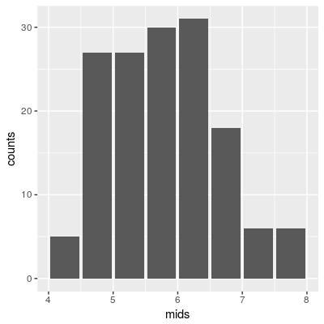
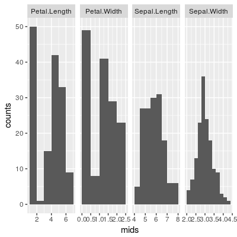

2019/3/19

こちらにもっと簡単な方法を紹介しました (通知が遅くなりました)．

「geom_histogramのビン幅を動的に決定する」
https://blog.atusy.net/2018/11/09/binwdith-for-geom-histogram/

[facetを使って多変量のヒストグラムをいっぺんに作る](#facetを使って多変量のヒストグラムをいっぺんに作る) 場合は本記事，最終節参照です．

#はじめに

`ggplot2：：geom_histogram`はデフォルトでビン数が30に固定されている．
試しにプロットすると，

```r
ggplot(iris, aes(x = Sepal.Length)) + geom_histogram()
`stat_bin()` using `bins = 30`. Pick better value with `binwidth`.
```

なんて返ってきて，ビン数(幅)は自分で調整してねと言われる．
これは探索的すぎて多変量を見たい時なんて特に面倒だ．

できれば，`graphics::hist`のように自動で決めてほしいし，なんなら，ビン幅を決めるアルゴリズムを任意に選択したい(`graphics::hist`でいうbreaks引数の指定)．

#`graphics::hist`と合体だ!

`graphics::hist`はhistogramクラスのリストを返す．
(引数`plot`がTRUEならプロットし，リストをinvisibleに返し，FALSEならプロットせずにリストをreturnする)

```r
> str(hist(iris[[1]]))
List of 6
 $ breaks  : num [1:9] 4 4.5 5 5.5 6 6.5 7 7.5 8
 $ counts  : int [1:8] 5 27 27 30 31 18 6 6
 $ density : num [1:8] 0.0667 0.36 0.36 0.4 0.4133 ...
 $ mids    : num [1:8] 4.25 4.75 5.25 5.75 6.25 6.75 7.25 7.75
 $ xname   : chr "iris[[1]]"
 $ equidist: logi TRUE
 - attr(*, "class")= chr "histogram"
```

このmidsとcountsを用いてggplot2で棒グラフを作ればいいのだ．

#やってみよう

```r

library(ggplot2)
library(dplyr)

iris[[1]] %>% #ヒストグラムを作るデータ
  hist %>% #度数分布の計算．
  `[`(c('mids', 'counts')) %>% #必要なデータの取り出し
  as.data.frame %>% #ggplotが受けつけるデータフレームの形に直す
  ggplot(aes(x = mids, y = counts)) %>% #プロット
  `+`(geom_col())
  

```



棒と棒の間に隙間があるのは，histogramとしては不恰好だし，ビンの幅によってはまるでデータのない部分かのように見えてしまうだろう．

```r

library(ggplot2)
library(dplyr)

iris[[1]] %>% #ヒストグラムを作るデータ
  hist %>% #度数分布の計算．
  `[`(c('mids', 'counts')) %>% #必要なデータの取り出し
  as.data.frame %>% #ggplotが受けつけるデータフレームの形に直す
  mutate(width = mids[2] - mids[1]) %>% #ビン幅の設定
  ggplot(aes(x = mids, y = counts, width = width)) %>% #プロット
  `+`(geom_col())
  

```


ぽくなったぞ!

#facetを使って多変量のヒストグラムをいっぺんに作る!

ここからはdplyrやtidyrに慣れていないと辛い

```r
library(ggplot2)
library(dplyr)
library(tidyr)

iris %>%
  gather(var, val, -Species) %>%
  group_by(var) %>%
  summarise(
    data = list(data.frame(hist(val, breaks = 'Scott', plot = FALSE)[c('mids', 'counts')]))
  ) %>%
  ungroup %>% 
  mutate(data = map(data, mutate, width = mids[2] - mids[1])) %>%
  unnest %>%
  ggplot(aes(x = mids, y = counts, width = width)) %>%
  `+`(list(
    geom_col(),
    facet_grid(. ~ var, scale = 'free')
  ))

```



変数ごとにビン幅を変えることに成功した!


