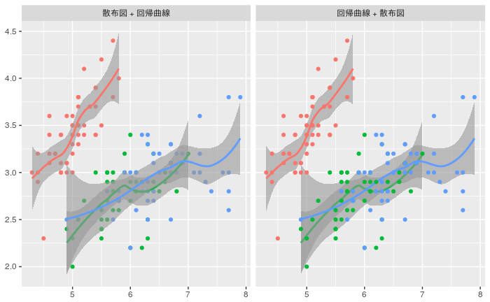

# ggplot2はレイヤの順番変更や、削除がやや手間

ggplot2は、便利な作図ツールですが、データや書式をレイヤに分けている関係上、レイヤを足す順番が大事になります。
例えば下記の図は、散布図と回帰曲線を足す順番を前後させたもの。
点を目立たせたいか、回帰曲線を目立たせたいか、考えてレイヤを足さなければなりません。



```r
library(ggplot2)
library(GGally)

gp <- ggplot(iris, aes(x = Sepal.Length, y = Sepal.Width, color = Species))

layers <- list(
  geom_point(),
  geom_smooth(alpha = 0.6)
)

ggmatrix(
  list(
    gp + layers,
    gp + rev(layers)    
  ),
  nrow = 1,
  ncol = 2,
  xAxisLabels = c(
    '散布図 + 回帰曲線', 
    '回帰曲線 + 散布図'
  )
)
```

この時、散布図+回帰曲線のプロットをした後に、やっぱり回帰曲線+散布図に直したいと思うと

```r
ggplot(iris, aes(x = Sepal.Length, y = Sepal.Width, color = Species)) +
  geom_point() +
  geom_smooth(alpha = 0.6)
```

の2行目と3行目を入れ替え、

```r
ggplot(iris, aes(x = Sepal.Length, y = Sepal.Width, color = Species)) +
  geom_smooth(alpha = 0.6)
  geom_point() +
```

2行目の行末に+を足し、3行目の行末から+を除くという、

```r
ggplot(iris, aes(x = Sepal.Length, y = Sepal.Width, color = Species)) +
  geom_smooth(alpha = 0.6) +
  geom_point()
```

2、3手間を要します。
これは面倒!

また、ここからやっぱり散布図がいらない! と思うと、
3行目をコメントアウトし、

```r
ggplot(iris, aes(x = Sepal.Length, y = Sepal.Width, color = Species)) +
  geom_smooth(alpha = 0.6) +
  # geom_point()
```

2行目の+もコメントアウト(or delete)する


```r
ggplot(iris, aes(x = Sepal.Length, y = Sepal.Width, color = Species)) +
  geom_smooth(alpha = 0.6) # +
  # geom_point()
```

必要があります。

やはり面倒だ。

# + NULLで解決!

この問題は`+ NULL`で解決できます。

```r
ggplot(iris, aes(x = Sepal.Length, y = Sepal.Width, color = Species)) +
  geom_point() +
  geom_smooth(alpha = 0.6) +
  NULL
```

としておくと、カットアンドペーストでレイヤの順番を変更したり、コメントアウトでレイヤを削除することもできます。

# レイヤのリストを足すとき

同様にリストの最後をNULLにしておくことで解決します。

```r
ggplot(iris, aes(x = Sepal.Length, y = Sepal.Width, color = Species)) +
  list(
    geom_point(),
    geom_smooth(alpha = 0.6),
    NULL
  )
```

# Enjoy!

ちなみに、同様に順番が命なパイプ演算子については、

```r
%>% return 
```

で終わるとよいことを過去の記事で書きました。

%>%で試行錯誤する時はreturnで終わろう
https://qiita.com/Atsushi776/items/dc3f6f81e9387d375269


