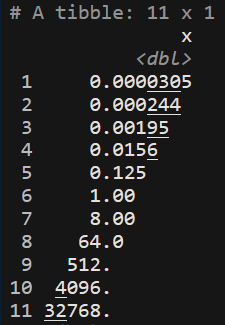

tidyverseユーザーにとって今やなくてはならない存在がtibbleかもしれませんが、近頃、こいつのprint結果は非難囂囂です。
例えば、以下のように数字を有効(？)数字で自動に丸め、重要な(？)部分とやらに下線を引きます。

```r
library(tibble)
x <- tibble::tibble(x = (8 ^ c(-5:5)))
x
```


バージョンによっては下線部をとそれ以外の文字色を変えていた模様。
見易いという人もいるかもしれませんが、見易さは自分で適宜調整するから生ものを返せという人もいるでしょう、

いかがいたしましょうか？

Rでは結果の出力に暗黙に`print`が呼ばれていることを利用します。

tibbleオブジェクトはtbl_df, tbl, data.frameのクラスから成るので、tbl_df用のprintを定義し、printする時だけ、data.frameに戻してやりましょう。

```r
print.tbl_df <- function(x, ...) print(as.data.frame(x))
```

するとtibbleオブジェクトがdata.frameとしてプリントされるようになり、幸せになれます。

```r
x
#               x
# 1  3.051758e-05
# 2  2.441406e-04
# 3  1.953125e-03
# 4  1.562500e-02
# 5  1.250000e-01
# 6  1.000000e+00
# 7  8.000000e+00
# 8  6.400000e+01
# 9  5.120000e+02
# 10 4.096000e+03
# 11 3.276800e+04
```


下記を毎回入力するのは面倒なので、.Rprofileにでも追記しておくと都合がいいのではないかと思います。

```r
print.tbl_df <- function(x, ...) print(as.data.frame(x))
```


Enjoy!!


2018/03/27 15:50追記

単にprint.tbl_dfをprint.data.frameと同じものにするという手もあるようです。

```r
print.tbl_df <- print.data.frame
```

