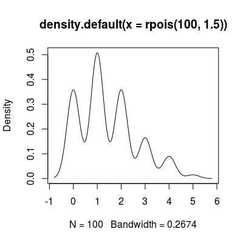
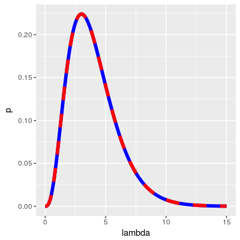
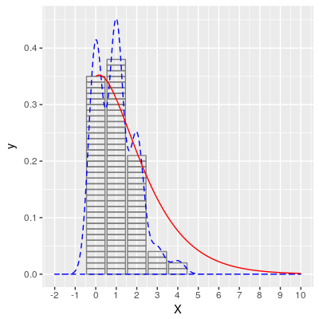

[yutanihilationさんの記事](http://notchained.hatenablog.com/entry/2017/12/02/091230)でアドベントカレンダーに空きがあるのを知ったので登録してみました．
タイトルはteramonagiさんリスペクトです([指数分布とポアソン分布のイケナイ関係](https://www.slideshare.net/teramonagi/ss-11296227))．


# Rでポアソン過程の観測値から期待値を密度推定したい

```r
plot(density(rpois(100, 1.5)))
```



orz...


## 問: ポアソン過程で得られた観測値がxの時，期待値λの分布は何分布？

## 答: 形状母数k = x + 1， 尺度母数θ = 1のガンマ分布

## 証明

ポアソン分布は期待値λ(> 0)の事象がX回起きる確率を教えてくれる離散確率分布で確率質量関数は以下の通り．

$$
Poisson(X) = \lambda ^ X e ^ {-\lambda} / X!
$$

従って，ある事象がx回(0以上の整数)起きた時の期待値の確率密度関数は

$$
P(\lambda) = \lambda ^ x e ^ {-\lambda} / x!
$$

となる．

ガンマ分布の確率密度関数は形状母数をk，尺度母数をθとして

$$
Gamma(X) = X ^ {k - 1} e ^ {-X/\theta} / \Gamma(k)
$$

と表される．
ここでΓはガンマ関数．
X = λ，k = x + 1, θ = 1の時，

$$
Gamma(\lambda) = \lambda ^ x e ^ {-\lambda} / \Gamma(x + 1)
$$

となる．
xは0以上の整数より，x+1は自然数だから，

$$
\Gamma(x + 1) = x!
$$

よって

$$
Gamma(\lambda) = \lambda ^ x e ^ {-\lambda} / x!
$$

となってP(λ)と一致する．

## Rで確認

例えばある事象を3回観察した時の期待値の分布は

```r
library(dplyr)
library(ggplot2)

x <- data.frame(
  X = 3,
  lambda = seq(0, 15, 0.1)
) %>%
  mutate(
    p = unlist(Map(dpois, x = X, lambda = lambda)),
    gamma = dgamma(lambda, shape = X + 1, rate = 1)
  )

ggplot(x, aes(x = lambda)) +
  geom_line(aes(y = p), lwd = 2, color = 'blue') + #青線
  geom_line(aes(y = gamma), lwd = 2, lty = 2, color = 'red') #赤線
```

ポアソン分布の確率質量関数から導出した期待値の分布(青線)と，ガンマ分布(赤線)が一致



# 応用例

## 期待値の密度推定

期待値1のポアソン分布に基く乱数を100個生成した時，

- ヒストグラム(ビン幅1)
- カーネル密度(青点線)
- 混合ガンマ分布(赤線)

により期待値の分布を見てみる．

```r
set.seed(123) # 乱数固定
X <- rpois(100, 1) # ポアソン分布に従う乱数生成
lambda <- seq(0, 20, 0.1) # ポアソン分布の期待値の密度の推定範囲を指定
X_dens <- X %>% # 混合分布を生成
  setNames(nm = .) %>%
  lapply(function(X) {
    data.frame(
      X = X,
      lambda = lambda,
      p = dgamma(lambda, X + 1)
    )
  }) %>%
  bind_rows() %>%
  group_by(lambda) %>%
  summarise(p = mean(p)) %>%
  mutate(X = NA_integer_)


ggplot(
  data.frame(X) %>%
    mutate(y = 1 / n()), 
  aes(x = X)
) +
  geom_col(aes(y = y), fill = NA, color = 'gray50') + # 乱数のヒストグラム
  geom_density(color = 'blue', lty = 2) + # 乱数の密度分布
  geom_line(data = X_dens, aes(x = lambda, y = p), color = 'red') + # 期待値の密度分布
  scale_x_continuous(breaks = -2:10, limits = c(-2, 10))
```



カーネル密度を使うと，本来あり得ない負の回数が起きる確率が推定されてしまう．
乱数が離散値であるため，マルチモーダルな密度分布が得られてしまう．
こういった問題を混合ガンマ分布では回避できる．

#感想

負の二項分布がポアソン分布の期待値がガンマ分布に従う時の分布に相当するから，データの過分散対策に使おうとか，ベイジアンでMCMCする時にポアソン分布の期待値の事前分布にガンマ分布を使おうっていうのはこの辺から来てるのかな……？
天下りが過ぎて，うまくいきそうなのはわかるけどなぜかわからなかったけど，納得できた．

また，ガンマ分布はWikipediaなんか見ても，どういう時に使うかは書いてあるけど，どういう時に起きるかは書いていなくて，一体ナニモノぞといった感じがしてしまう．
非負で連続値をとる確率過程はガンマ分布で! なんて言われても……．
まさしくポアソン分布の期待値は非負の連続値をとるのだけれども，実際これがガンマ分布に従うことが今回わかって嬉しい．

あと，混合分布の厳密(？)な作りかたがよくわからず，積分値が1になるよう，混合する各分布におけるxの確率密度の平均を混合分布のxにおける確率密度としてプロットしてみたけどあっているのだろうか……．

