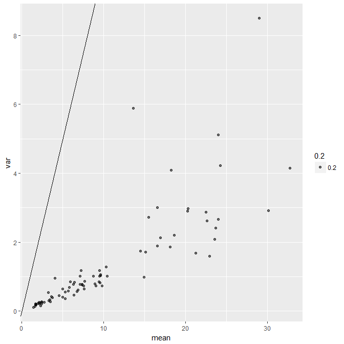
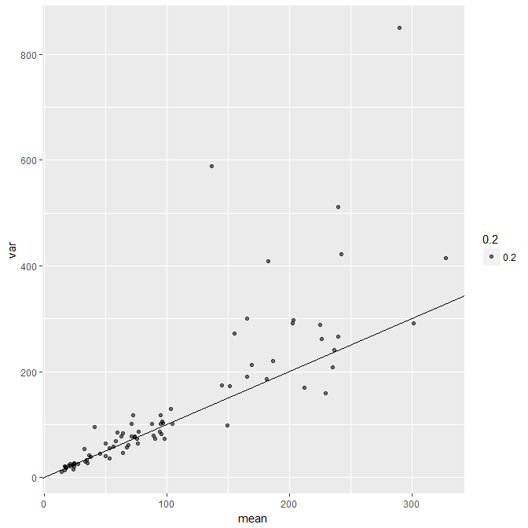

#概要

- ポアソン分布に従うデータ(平均値$λ$)を時間や空間で規格化しようとして、定数$k$で割ると平均値$λ$は$λ/k$と分散は$λ/k^2$になる。
-  規格化されたカウントデータにおいて平均値 $\neq$ 分散
-  もはやポアソン分布ではなくなってしまう。
-  ポアソン分布を仮定できるデータは個数データであって割合データではない。
-  おまけにこれを体感できるRコードを付録した。

#始めに

久保さんが「[何でも「割算」するな](http://hosho.ees.hokudai.ac.jp/~kubo/stat/2011/z/skubostat2011z.pdf)」と警鐘を鳴らしている。

その理由の一つとして

  -  観測値 / 観測値がどんな確率分布に従うのか見通しが悪い

ということを挙げている。

まさしくこの事例にあたる現象にぶつかったので紹介する。


#単位時間あたりの信号検出率はポアソン分布にならない。

##過少分散の例

以下に示すのはEPMA(電子線マイクロアナライザ)による単位時間あたりのX線カウント数の平均値(mean)と分散(var)の散布図。
mean = varとなるところに直線を引いてある。



分散と平均値が比例していることにポアソン分布らしさを感じる。
しかし、ポアソン分布と見做すには、随分と過少分散しているのが分かる。

##原因

上述の問題は5秒間計測したデータを単位時間あたりのデータに変換してしまっているため。

ポアソン分布に従うデータは、平均値($\bar{x}$)と分散($s^2$)が同じになる特徴を持つ。
ここで、標本分散の計算式は

$s^2 = 1/(n-1)\sum_{i=1}^{n}(\bar{x} - x_i)^2$

だから、元データが定数$k$で割られていた場合、新たに得られる平均値は$kλ$であるのに対し、分散は$k^2λ$となってしまう。

従って分散 / 平均値 = kとなり、

- $k > 1$ならば過少分散
- $0 < k < 1$ならば過剰分散

が発生する。

##どうする？

単位時間あたりのX線検出率を、X線検出回数に戻してやればいい。
つまり、データを5倍する。



一部に過剰分散が認められるが、概ね平均値と分散が$1:1$になったのが分かると思う。

#結論

ポアソン分布はあくまで個数データに期待される分布で、割合データに期待するものではない。

#おまけ(Rコード)

今回の問題を体感してもらえるRコードを残しておきます。

```

#模擬データの作成

##集団の数
group <- 30 

##各集団に属する固体の数

n_min <- 1
n_max <- 100

n <- round(runif(group, n_min, n_max))

##各集団の何らかのカウントデータの平均値
lambda_min <- 9.1
lambda_max <- 100

lambda <- round(runif(group, lambda_min, lambda_max))

##集団ごとに、乱数を生成
d <- Map(rpois, lambda, n)

##集団ごとの平均値、分散を算出
d_mean <- sapply(d, mean)
d_var <- sapply(d, var)

##プロット(平均値v.s.分散)
##結果はy = xに乗る
plot(d_mean, d_var, xlim = c(0, max(d_mean)), ylim = c(0, max(d_var)))
abline(0, 1)


##dを定数kで割った時の
##平均値v.s.分散
##結果はy = xから外れる
k <- 5

d_per_k <- lapply(d, `/`, k)
d_per_k_mean <- sapply(d_per_k, mean)
d_per_k_var <- sapply(d_per_k, var)

plot(d_per_k_mean, d_per_k_var, xlim = c(0, max(d_per_k_mean)), ylim = c(0, max(d_per_k_var)))
abline(0, 1)


```


