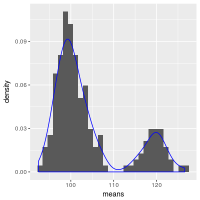
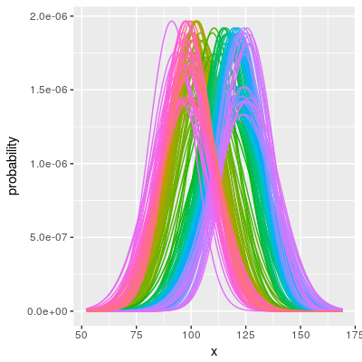
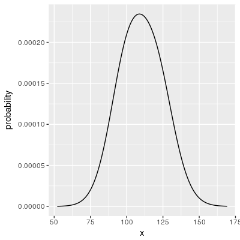
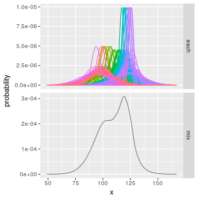
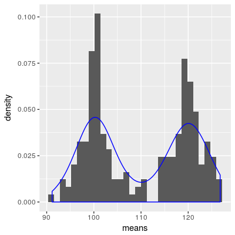

#普通にヒストグラム&カーネル密度推定



#実際には各観測値はそれぞれに誤差を持つ



#誤差を考慮した密度推定はできないか？

##とりあえず，混合分布にしてみる



中心極限定理めえ!!

##誤差がある程度小さいときはうまくいく



とはいえ，フツーに密度推定した方が分かりよい．



これは， ヒストグラムやカーネル密度が，各観測値の誤差が同程度で十分小さい場合の混合分布に近似されるためと考えられる．


そういう意味では， ヒストグラムやカーネル密度では過剰に分離して見えてしまっているわけか……．
どっち使うのがいいのだろう？

#今回使ったRコード

```r

require(ggplot2)

#misture normal distributions
dmnorm <- function(means, sigmas, groups = NA, x = NULL) {
  
  #set x
  if(is.null(x)) {
    x_min <- min(means - 3 * sigmas)
    x_max <- max(means + 3 * sigmas)
    x_by <- 10 ^ (round(log(x_max - x_min, 10)) - 4)
    x <- seq(x_min, x_max, x_by)
    rm(x_min, x_max, x_by)
  }
  
  #set groups  
  if(is.na(groups)) {
    groups <- as.character(means)
  } else if(length(groups) != length(means)) {
    stop('groups should be NA or a vector wit length equal to means')
  }
  
  groups <- unlist(lapply(c(groups, NA), rep, length(x)))
  
  #estimate each distributions
  each <- Map(function(means, sigmas, .x = x) dnorm(.x, means, sigmas), means, sigmas)
  
  #estimate mixture distributions
  mix <- rowSums(as.data.frame(each))
  
  #output data.frame
  data.frame(
    x = x,
    probability = c(unlist(each), mix) / sum(mix),
    group = groups
  )
  
}

#random number based on mixture normal distributions
rmnorm <- function(n, means, sigmas, prob = NULL, groups = NA) {
  n <- table(sample(x = length(means), size = n, replace = TRUE, prob = prob))
  unlist(Map(rnorm, n, means, sigmas))
}

#test
set.seed(123)
n <- 20
means <- rmnorm(n, c(100, 120), runif(n, 1, 5))
sigmas <- runif(n, 1, 15)
age <- dmnorm(means, sigmas) %>% mutate(facet = ifelse(is.na(group), 'mix', 'each'))

#each and mixture distributions
ggplot(age, aes(x = x, y = probability, color = group)) +
  geom_line() +
  theme(legend.position = 'none') +
  facet_grid(facet ~ ., scale = 'free')

#histograms and kernel densities
ggplot(as.data.frame(means), aes(x = means, y = ..density..)) +
  geom_histogram() +
  geom_density(color = 'blue')


```

